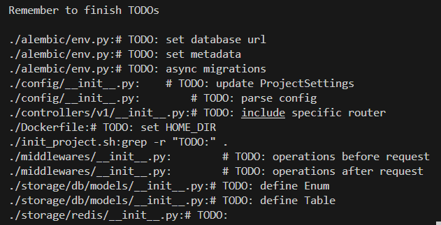

# FastAPI backend template

## Quick start
1. 创建虚拟环境
    - 以 conda 为例:

        ```bash
        $ conda create -n project_name python=3.10
        $ conda activate project_name
        ```
2. 安装必要依赖 `poetry` (管理依赖), `ruff` (代码格式化)
    - 如果未安装 `poetry` 可参考 [poetry官网安装教程](https://python-poetry.org/docs/)
    - 不必安装在项目的虚拟环境中, 可以使用 `pipx` 安装, 在所有虚拟环境中可以共用

        ```bash
        (base) $ pip install pipx
        (base) $ pipx install poetry
        (base) $ pipx install ruff
        ```

3. 调用 `./init_project.sh`
4. 根据提示修改模板代码中的 `TODO` 为项目相关内容

    
